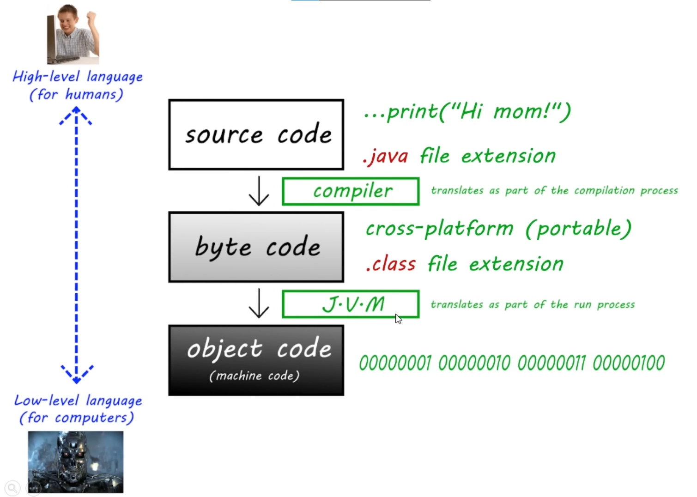
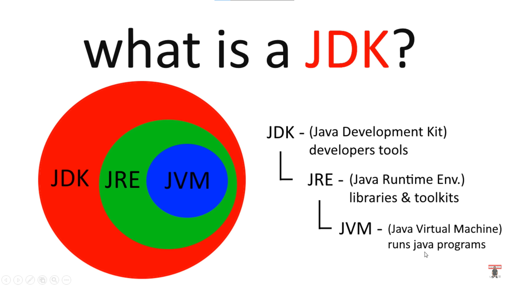
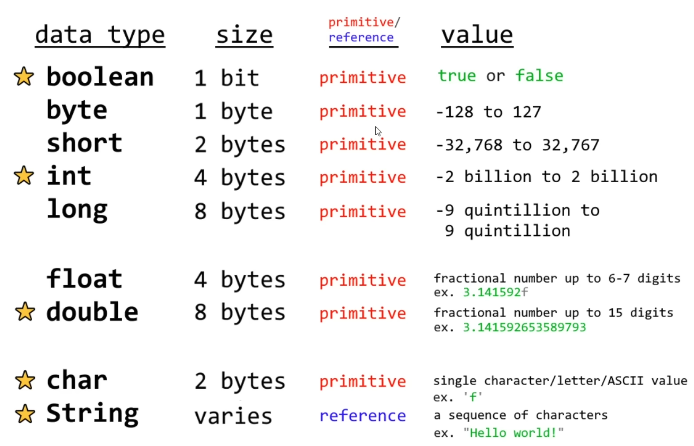
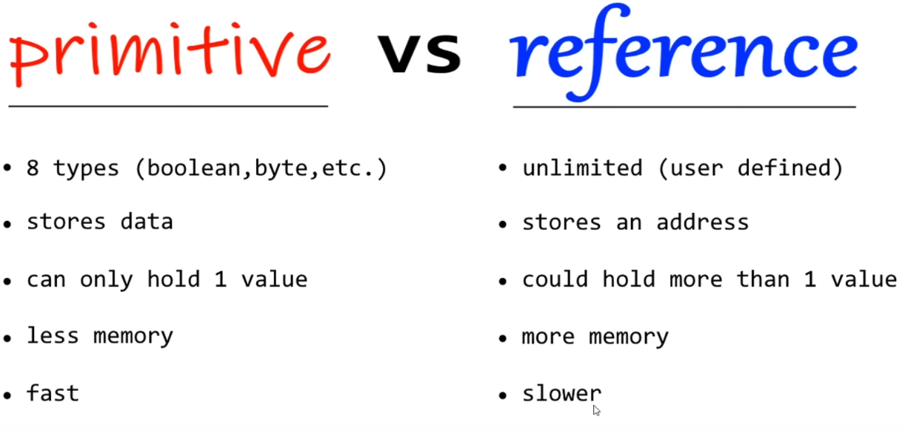
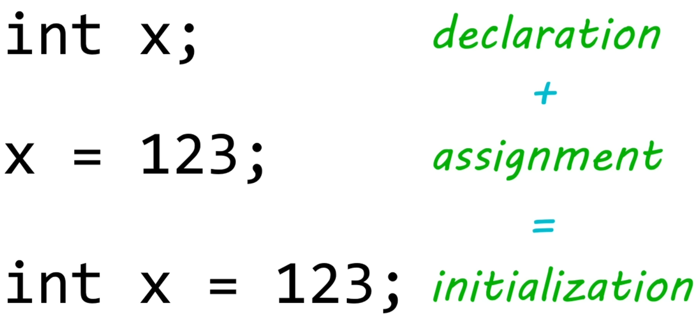

# Java

### Class
Class is collection of related codes, Unique name
### print vs println
`print` statement output comes in straight line cuz the cursor doesn't move in a straight line, `println`(print Line) adds a new line as soon as we finish outputting the sentence. Or we can use escape character `\n` while using `print`.\
\t - add tab space\
\" - If we want to display quotes literally in a string we use escape character.
### Tricks
Spaces don't matter in most cases `System.out.       println()` will work but `System.ou t.println()` won't as the keyword is breaking.

# Basics
### Variable
a placeholder for a value that behaves as the value it contains
### Data Types

float is less precise than double\
char and String behave differently cuz they are primitive and reference type respectively.

### How to create a variable?
\
#### int
For very big integers use `long`. `long x = 1362167468746495969647645L;` number should be followed by **L**
#### float
Fractional numbers, number with decimal point.\
_Float_ : `float x = 3.145f;` need to use *f*\
_Double_ : `double x = 3.1452` more precise nothing to add at the end. Stores up to digits after decimal point.